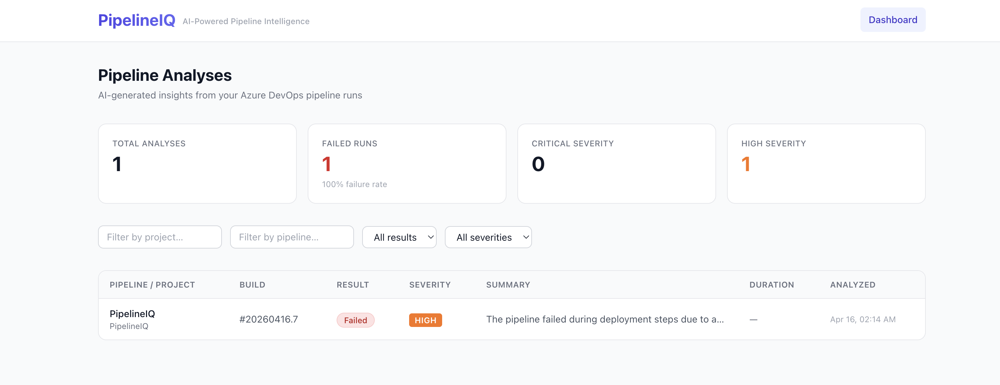

# PipelineIQ

> **Stop digging through logs. Know exactly why your pipeline failed — in seconds.**

When a CI/CD pipeline fails, engineers typically open Azure DevOps, hunt through thousands of lines of logs across multiple steps, piece together the root cause, and figure out a fix — all manually. For complex pipelines this can take 30–60 minutes per failure.

PipelineIQ eliminates that. It listens to Azure DevOps webhook events, automatically fetches the logs and failed step timeline, and sends them to GPT-4o for analysis. Within seconds of a build completing, the dashboard shows you the root cause, affected steps, error snippets, and concrete fix recommendations — no log-digging required.

---


<!-- Replace with an actual screenshot: File → screenshot the live dashboard → save as docs/screenshot.png -->

**Live dashboard:** [https://proud-sea-04a379a0f.7.azurestaticapps.net](https://proud-sea-04a379a0f.7.azurestaticapps.net)  
**API base:** `https://pipelineiq-dev-functions.azurewebsites.net/api`  
**Webhook URL:** `https://pipelineiq-dev-functions.azurewebsites.net/api/webhook`

---

## Tech stack


| Layer | Technology |
|---|---|
| Backend | Python · Azure Functions v4 (serverless) |
| AI | Azure OpenAI GPT-4o (structured JSON output) |
| Database | Azure Cosmos DB (serverless, change-feed trigger) |
| Frontend | React 18 · Vite · TypeScript · Tailwind CSS |
| Infrastructure | Azure Bicep (IaC, dev + prod environments) |
| CI/CD | Azure Pipelines (lint → test → build → deploy) |
| Observability | Azure Application Insights |

---

## Key features

- **Automatic failure analysis** — Cosmos DB change-feed triggers GPT-4o analysis the moment a failed run is stored; no polling needed
- **Root cause + recommendations** — structured AI output includes severity rating, affected steps, error snippets, and actionable fix suggestions
- **Filterable dashboard** — filter by project, pipeline, result, or severity; paginated list with aggregate stats
- **Secure webhook ingestion** — HMAC-safe secret validation on every incoming event
- **Full IaC** — one Bicep command provisions all Azure resources (Functions, Cosmos DB, OpenAI, Static Web App, App Insights)
- **33 backend tests + frontend tests** — pytest with mocks for all Azure SDK calls; vitest + Testing Library for React components
- **4-stage CI/CD pipeline** — ruff lint, pytest, tsc, vitest on every push; Bicep deploy + prod approval gate on main

---

## How it works

```
Azure DevOps ──webhook──▶ webhook_receiver (Azure Function)
                                │
                                ▼
                         Cosmos DB (runs)
                                │
                  Cosmos change-feed trigger
                                │
                                ▼
                      pipeline_analyzer
                      ├── fetch logs (Azure DevOps API)
                      ├── fetch timeline (failed steps)
                      └── GPT-4o analysis
                                │
                                ▼
                         Cosmos DB (analyses)
                                │
                    api_get_analyses / api_get_analysis
                                │
                                ▼
                         React Dashboard
```

---

## Project structure

```
PipelineIQ/
├── backend/                   # Azure Functions (Python)
│   ├── shared/
│   │   ├── models.py          # Pydantic data models
│   │   ├── cosmos_client.py   # Cosmos DB helpers
│   │   ├── devops_client.py   # Azure DevOps API client
│   │   └── ai_analyzer.py     # GPT-4o analysis logic
│   ├── webhook_receiver/      # POST /api/webhook
│   ├── pipeline_analyzer/     # Cosmos DB change-feed trigger
│   ├── api_get_analysis/      # GET /api/analyses/{id}
│   ├── api_get_analyses/      # GET /api/analyses
│   ├── tests/                 # pytest test suite
│   ├── host.json
│   ├── requirements.txt
│   └── requirements-dev.txt
├── frontend/                  # React + Vite + Tailwind
│   ├── src/
│   │   ├── components/        # StatusBadge, StatsBar, FilterBar, AnalysisRow, Header
│   │   ├── pages/             # Dashboard, AnalysisPage
│   │   ├── services/api.ts    # API client
│   │   └── types/index.ts     # TypeScript types
│   └── package.json
├── infra/                     # Bicep infrastructure
│   ├── main.bicep
│   ├── parameters/
│   │   ├── dev.bicepparam
│   │   └── prod.bicepparam
│   └── modules/
│       ├── cosmos.bicep
│       ├── functions.bicep
│       ├── monitoring.bicep
│       ├── openai.bicep
│       └── static-web-app.bicep
└── azure-pipelines.yml        # CI/CD pipeline
```

---

## Deployed resources (dev)

| Resource | Name pattern |
|---|---|
| Resource group | `rg-pipelineiq-dev` |
| Cosmos DB | `pipelineiq-dev-cosmos` |
| Azure OpenAI (GPT-4o) | `pipelineiq-dev-openai` |
| Function App | `pipelineiq-dev-functions` |
| Static Web App | `pipelineiq-dev-frontend` |
| App Insights | `pipelineiq-dev-insights` |
| Region | `eastus2` |

---

## Prerequisites

- Python 3.11+
- Node.js 20+
- [Azure Functions Core Tools v4](https://learn.microsoft.com/en-us/azure/azure-functions/functions-run-local)
- Azure CLI
- An Azure DevOps organization with a PAT scoped to **Build (Read) + Code (Read & write)**
- An Azure OpenAI resource with a `gpt-4o` deployment
- An Azure Cosmos DB account

---

## Local development

### Backend

```bash
cd backend
cp local.settings.json.example local.settings.json
# Fill in values from your deployed Azure resources

python -m venv .venv
source .venv/bin/activate        # Windows: .venv\Scripts\activate
pip install -r requirements-dev.txt

func start
```

The functions will be available at `http://localhost:7071/api/`.

### Frontend

```bash
cd frontend
npm install
VITE_API_BASE_URL=https://pipelineiq-dev-functions.azurewebsites.net/api npm run dev
```

The dashboard runs at `http://localhost:3000`.

### Running tests

```bash
# Backend
cd backend
pytest --tb=short

# Frontend
cd frontend
npm test
```

---

## Deploy to Azure (Bicep)

```bash
# 1. Create resource group
az group create --name rg-pipelineiq-dev --location eastus2

# 2. Export secrets
export AZURE_DEVOPS_PAT=your-pat
export WEBHOOK_SECRET=your-webhook-secret

# 3. Deploy all infrastructure (~5 minutes)
az deployment group create \
  --resource-group rg-pipelineiq-dev \
  --template-file infra/main.bicep \
  --parameters infra/parameters/dev.bicepparam \
  --parameters devOpsPat="$AZURE_DEVOPS_PAT" webhookSecret="$WEBHOOK_SECRET"

# 4. Deploy backend
cd backend
func azure functionapp publish pipelineiq-dev-functions

# 5. Build and deploy frontend
cd frontend
VITE_API_BASE_URL=https://pipelineiq-dev-functions.azurewebsites.net/api npm run build
npx @azure/static-web-apps-cli deploy dist \
  --deployment-token <swa-token-from-deployment-output> \
  --env production
```

> **Note:** Azure OpenAI requires approved access — request it at https://aka.ms/oai/access before deploying. GPT-4o is supported in `eastus2`.

---

## Azure DevOps webhook setup

1. Go to **Project Settings → Service Hooks → + Create subscription**
2. Choose **Web Hooks** → Next
3. Trigger: **Build completed** → Next
4. URL: `https://pipelineiq-dev-functions.azurewebsites.net/api/webhook`
5. Add HTTP header: `X-Pipeline-Secret: <your-webhook-secret>`
6. Click **Finish**

---

## CI/CD pipeline

The `azure-pipelines.yml` defines 3 stages:

| Stage | Trigger | What it does |
|---|---|---|
| **Test** | All branches + PRs | ruff lint + pytest + tsc + vitest |
| **Build** | main only | vite build + zip backend |
| **Deploy Dev** | main only | Bicep infra + func publish + SWA deploy |

### One-time setup required in Azure DevOps

| What | Where |
|---|---|
| Variable group `pipelineiq-dev-secrets` | Pipelines → Library |
| Service connection `azure-dev` | Project Settings → Service Connections |
| Environment `pipelineiq-dev` | Pipelines → Environments |

---

## API reference

### `GET /api/analyses`

Returns paginated analyses with aggregate stats.

Query params: `limit`, `offset`, `project`, `pipeline`, `result`, `severity`

**Response:**
```json
{
  "analyses": [...],
  "stats": {
    "total": 10,
    "failed": 4,
    "succeeded": 6,
    "critical": 1,
    "high_severity": 3
  },
  "pagination": { "limit": 50, "offset": 0, "returned": 10 }
}
```

### `GET /api/analyses/{id}`

Returns a single analysis document with full AI insights.

### `POST /api/webhook`

Receives Azure DevOps `build.complete` events.  
Requires header: `X-Pipeline-Secret: <secret>`

---

## Cosmos DB containers

All containers are created automatically by the Bicep deployment.

| Container | Partition key | Purpose |
|---|---|---|
| `runs` | `/id` | Raw pipeline run events |
| `analyses` | `/id` | AI-generated analyses |
| `leases` | `/id` | Change-feed trigger leases |
